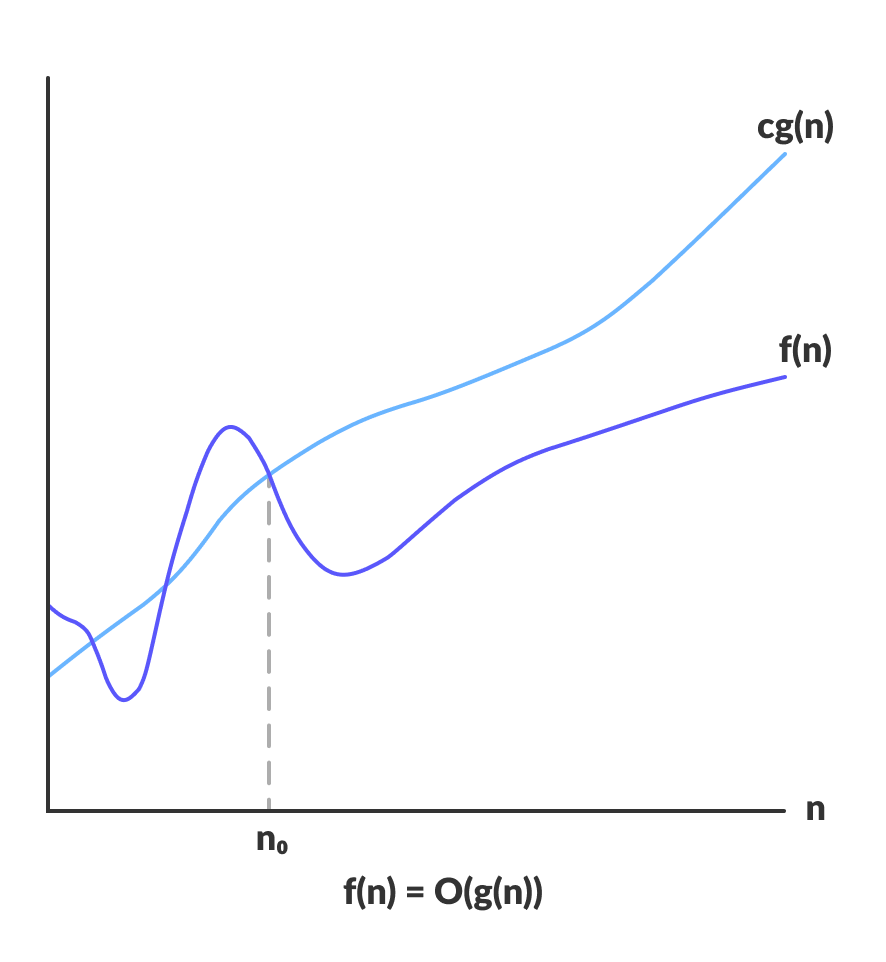

Algoritmos y complejidad 
===

### Ayudantía 1

---
# Temario
- Asintóticas (más que todo Big O).
- Pérdida de significancia y errores.
- Ejercicios. 

---
# Asintóticas
- Nos permiten conocer el comportamiento de una función $f(x)$ a medida que $x \rightarrow \infty$.
- Usada para clasificar algoritmos en función del **tiempo de ejecución** estimado mediante una función $f(n)$ que indica la cantidad de **operaciones clave** a realizarse.

---
## Big O
- $f(x) = O(g(x))$. 
- Existen  $x_0$ y $c$ tal que $\in \R$. $|f(x)| \leq c |g(x)|, x \geq x_0$.
- Permite expresar una **cota superior** a partir de un $x_0$.
- Se dice que $f$ es **a lo más** de orden $O(g(x))$.
- Se puede leer como "$f$ no crece más rápido que $g$".
> $O(f(x))$ hace referencia al **orden** de $f$, entendido como la **taza de crecimiento**.

---
- En la practica el valor de $c$ no será de gran interés.
- Estrictamente deberíamos  decir $f(x) \in O(g(x))$.
- En particular, la usaremos mucho para **acotar el error** $e_n.$ A medida que $n \rightarrow \infty$, $O(e_n)$ (con un poco de suerte) se hará cero.


---
> The beauty of the O-notation is that it allows us to express, in a succinct and suggestive manner, the existence of such a constant without having to write down the constant. :heart:


--- 

### Criterio límite
Si se cumple:
$$\lim \limits_{x \rightarrow \infty} \frac{f(x)}{g(x)} = k$$

con $k \in \R$ podemos decir $f = O(g(x))$, aunque esta notación no siempre sea del todo ajustada.

:arrow_right: En particular si el limite es $0$, diremos que $f$ es de **menor orden** que $g$, esto se expresa mediante *Little Oh*: $f(x) = o(g(x))$. 


---
> En el área de la informática se suelen trabajar con funciones $f: \N \rightarrow \R^+$. Se busca describir el comportamiento de un algoritmo en función de la cantidad de datos $n$.

> Esto permite "olvidarse" de los valores absolutos en las definiciones. :thinking:


---

### Ejemplos :pray:
Acote superiormente las siguientes funciones definidas con dominio $\N$ utilizando la notación $O(g(n))$:
1. $f(n) = 10^{80}$ 
2. $f(n) = (20 \cdot n)^7$
3. $f(n) = log(n^{100})$
4. $f(n) = n^2 + 2n$

5. $f(n) = \sqrt{n + 1}$

6. $f(n) = log(n)$
7. $f(n) = sin(n)$

---
### Algunas propiedades :bulb:
1. $f(x) = O(f(x))$.
   
2. $O(O(f(x))) = O(f(x))$.
   
3. Si $f(x) = O(g(x))$ y $g(x) = O(h(x))$ entonces por transitividad $f(x) = O(h(x))$. 
   
4. Si $g(x) = O(h(x))$, entonces $f(x) = cg(x) + O(h(x))$ es equivalente a $f(x) = O(h(x))$.

5. Si $f(x) = O(k g(x))$, entonces $f(x) = O(g(x))$ para $k > 0$.

---
Si $f_1(x) = O(g_1(x))$ y $f_2 = O(g_2(x))$, tenemos:

6. $f_1(x) + f_2(x) = O(|g_1(x)| + |g_2(x)|)$
   
7. $f_1(x) \space \cdot f_2(x) \space = O(|g_1(x)| \space \cdot \space |g_2(x)|)$
   
8. $f_1(x) - f_2(x) = O(|g_1(x)| + |g_2(x)|)$
   
:warning: :skull: Especial cuidado con $O(g(x)) - O(g(x))$. 

---

Para cualquier función $h(x)$:

9. $h(x)(f_1(x) + f_2(x)) = O(|h(x)| (g_1(x) + |g_2(x)|)$.
    
10. Si $f(x) = O(g(x)h(x))$, entonces $f(x) = g(x)O(h(x))$

El orden de una suma de funciones viene dado por la función de **más rápido crecimiento** : :bulb:

11. $O(f + g + h + ...) = O(max(f, g, h, ...))$


---
## Big Omega
- $f(x) = \Omega(g(x))$.
- Existen  $x_0$ y $c$ tal que $\in \R$. $|f(x)| \geq c |g(x)|, x \geq x_0$.
- Permite expresar una **cota inferior** a partir de un $x_0$.
- Se dice que $f$ es **al menos** de orden $O(g(x))$.


---
### Criterio límite
Si se cumple:
$$\lim \limits_{x \rightarrow \infty} \frac{f(x)}{g(x)} = \infty$$

diremos $f(x) = \Omega(g(x))$.

:arrow_right: Verifique $x = \Omega(log(x))$.

---
## Big Theta 

- $f(x) = \Theta(g(x))$. 
- $f(x) = O(g(x))$ y $f(x) = \Omega(g(x))$.
- $f(x)$ a partir de $x_0$ se comporta igual que $g(x)$.
- Se dice que $f$ y $g$ son del **mismo orden**.


---

### Criterio límite
Si se cumple:
$$\lim \limits_{x \rightarrow \infty} \frac{f(x)}{g(x)} = k$$

con $k \in \R - \{0\}$, diremos $f(x) = \Theta(g(x))$.

:arrow_right: En particular si $k=1$, diremos $f \sim g$: esto significa que $f$ **es igual** a $g$ asintoticamente.


---
# Errores y Pérdida de significancia
- A lo largo del curso, el manejo de errores es crucial.
- La pérdida de significancia amenaza nuestro objetivo: encontrar numéricamente buenas aproximaciones a diversos problemas.
- Esta pérdida de significancia se genera cuando restamos números que para nosotros son muy cercanos, pero **iguales para la máquina**. :robot:

- Generalmente la solución a estos problemas es simple, sin embargo notar su presencia no.
  

---

## Ejemplo :robot:
Sea $f(x) = \frac{1-cos(x)}{sin^2(x)}$ y $g(x) = \frac{1}{1 + cos(x)}$.

Es fácil notar que:
$$f(x) = \frac{1-cos(x)}{sin^2(x)} \cdot \frac{1 + cos(x)}{1 + cos(x)}  = \frac{1 - cos^2(x)}{(1 - cos^2(x)) (1 + cos(x))} = g(x)$$

¿Qué pasa cuando $x \rightarrow 0?$ 

---

```python
import numpy as np
import pandas as pd

def f(x):
    return (1 - np.cos(x))/(np.sin(x))**2 

def g(x):
    return 1/(1 + np.cos(x))

# Puntos a evaluar
points = [0.1, 0.01, 0.001, 0.0001, 1e-05, 1e-06, 1e-07, 1e-08, 1e-09, 1e-10]

# Generar imágenes para f y g 
d = dict()
for x in points:
    #print("x = " + str(x) + " f(x) = " + str(f(x)) + " g(x) = " + str(g(x)))
    d[x] = [f(x), g(x)]

data = pd.DataFrame(d, index = ["f(x)", "g(x)"])
print(data.T)

```

---
Al ejecutar el código anterior, se obtiene la siguiente tabla: :thinking:


| x  | f(x)  | g(x)  |
|---|---|---|
|1e-01|  0.501252|  0.501252|
|1e-02|  0.500013|  0.500013|
|1e-03|  0.500000|  0.500000|
|1e-04|  0.500000|  0.500000|
|1e-05|  0.500000|  0.500000|
|1e-06|  0.500044|  0.500000|
|1e-07|  0.499600|  0.500000|
|1e-08|  0.000000|  0.500000|
|1e-09|  0.000000|  0.500000|
|1e-10|  0.000000|  0.500000|

---
- Esto ocurre porque la precisión requerida para los cálculos $f(x)$ excede la que nos otorga Python (doble precisión).
- La mantisa no da abasto, se debe hacer un redondeo o un recorte. Ambas alternativas provocan el mismo (triste) desenlace.

> Python sigue el estandar IEEE 754.

---

## Errores
Sea $x_c$ la aproximación de un número real $x$. Tenemos las clásicas formas de cuantificar el errror:

- Error absoluto: $|x_c - x|$
  
- Error relativo: $\frac{|x_c - x}{|x|}$

> En problemas de mayor interés, no conoceremos el valor real $x$. ¿Cómo podríamos cuantificar el error? :thinking:

---

# Ejercicios

Encuentre cotas superiores ajustadas para:
1. $f(n) = log(log(n^n))$
2. $f(n) = \sum \limits_{k=1}^n k^2$
3. $f(n) = \sum \limits_{k = 1}^n \sqrt{log \space k}$

---

4. Encuentre cotas ajustadas para $f(x) = x + xsin(x)^2$.
> Puede encontrar las constantes y luego graficar $f(x)$ y sus cotas para verificar su trabajo.
5. Demuestre $log(n^2 + 1) = O(log(n))$.
6. Simplifique $(1 + \frac{1}{x} + O(\frac{1}{x^2}))^2$.
7. Determine en qué parte de la fórmula para resolver ecuaciones de segundo grado podrían generarse problemas. Reestructure la ecuación para evitar la pérdida de significancia.