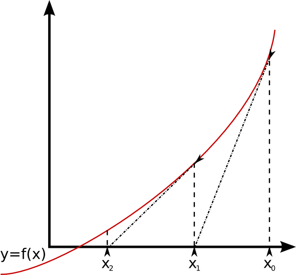

Algoritmos y complejidad 
===

### Ayudantía 2

---
# Temario
### Métodos de búsqueda de raíces
- Método de la bisección.
- Iteraciones de punto fijo.
- Método de Newton. :alien:
- Método de la Secante y Regula Falsi.
- Backward y Forward error.
- Ejercicios. 

---
# Método de la bisección
- Trabaja con una función continua $f$ y un intervalo $[a,b]$ en el cual $f$ tiene un cero (se cumple teorema del Bolzano).
- La idea es tomar el punto medio $c$ de $[a,b]$ y **seguir buscando en la mitad donde se encuentra el cero**. 

> ¿Qué pasa si existen dos o más ceros en $[a,b]$ ? :thinking:

---
### Implementación en Python

```python
def biseccion(f,a,b,epsilon):
    while( (b-a)/2 > epsilon):
        c = (a + b)/2
        if f(c) == 0: break
        if f(a)*f(c) < 0:
            b = c
        else:
        	a = c
    return (a+b)/2
```
---
### Análisis
- Luego de $n$ iteraciones, tenemos un intervalo [$a_n$,$b_n$] de longitud $\frac{b-a}{2^n}$.
- El error absoluto está **acotado superiormente**: 
$$|x_i - r| < \frac{b-a}{2^{n+1}}$$

- **Garantiza convergencia lineal** con razón 1/2. :bulb:
---
# Recordar
:bulb: Una solución **es correcta en $p$ posiciones decimales** si el error relativo es menor que $0.5 \cdot 10^{-p}$.

---
# Pregunta salvaje :smile:
¿Cuántas iteraciones se necesitan para obtener una raiz de $f(x) = e^x - x^2$ en [-1,0] con 6 posiciones correctas?
### Respuesta
* Acotar error: $\epsilon < \frac{b-a}{2^{n+1}} = \frac{1}{2^{n+1}}$
* Aplicar definición slide anterior: $\frac{1}{2^{n+1}} < \frac{1}{2} \cdot 10^{-6}$
* Despejar $n$: $n > \frac{\ln 10^6}{\ln  2} \approx 19.9$
> ¿Depende esto de la función?

---
# Convergencia lineal
- Supongamos un método iterativo que cumple: 
$$\lim \limits_{n \rightarrow \infty} \frac{e_{i+1}}{e_i} = S$$
- Si $S < 1$, entonces el **método converge linealmente** con razón $S$.
- Si $S = 0$ existe una convergencia de órden superior.

---
### Razón de convergencia para bisección
1. $\displaystyle e_i = \frac{b-a}{2^n}$.

2. $\displaystyle e_{i+1} = \frac{b-a}{2^{n+1}}$.

3. $\displaystyle \frac{e_{i+1}}{e_i} =  \frac{b-a}{2^{n+1}} \cdot  \frac{2^{n}}{b-a} =\frac{1}{2}$.
   

:warning: No es necesario analizar el límite cuando $n \rightarrow \infty$ pues la fracción es constante.


---


# Iteración punto fijo (IPF)

Dada una función $f(x)$:
- $c$ es un **punto fijo** de $f(x)$ ssi $f(c) = c$.
- Construiremos $g(x) = x$ a partir de $f(x) = 0$.
- Al encontrar un punto fijo para $g(x)$ se encontrará un cero para $f(x)$ .

---

- Una iteración inocente luce así:
```python
def fixed_point_iteration(g, x, n):
    # Asumiendo que converge en n iteraciones
    for i in range(n): 
        x = g(x)
    return x
```

- La iteración **puede o no converger** (:cry:), pero si la función es continua y converge a $r$, $r$ es un punto fijo.
- El error absoluto en la iteración i-ésima es: $e_i = |r - x_i|$ donde $r$ es el punto fijo de interés.


---
### Ejemplo :pray:
- Sea $g(x) = \frac{1}{3}x + 1$ con punto fijo $\frac{3}{2}$.

- Al iterar con un **initial guess** de $0.1$ tenemos:.
$$ g(0.1) \approx 1.033 $$
$$ g(1.033) \approx 1.344 $$
$$ g(1.344) \approx 1.448 $$
$$ g(1.448) \approx 1.482 $$
$$ g(1.482) \approx 1.494 $$

---
### Desafío :bulb:
Sabemos que si la iteración de punto fijo converge a un valor, **este valor será un punto fijo**.

Codifique un programita más inteligente que el recién presentado, que sea capaz de **intuir** si la iteración convergió. En tal caso debe indicar el valor aproximado. De lo contrario debe indicar que no se ha podido converger.


---


### Análisis convergencia IPF
Si tenemos:
- $g$ diferenciable continuamente.
- $g(x^\ast) = x^\ast$.
- $\lim \limits_{n \rightarrow \infty} \frac{e_{i+1}}{e_i} = S = |g^\prime (x^\ast)| < 1$.

Entonces la IPF **converge linealmente** con razón $S$ hacia $r$ para estimaciones iniciales **lo suficientemente cerca** de $r$.

:warning: No siempre sirve cualquier initial guess.

---

- Una IPF puede ser **más lenta o más rápida que el método de la bisección** dependiendo de si $S$ es mayor a $\frac{1}{2}$.
- Como en el límite podemos decir $e_{i+1} = S e_i$ (el error disminuye en S cada paso), podremos obtener una aproximación al número $n$ de iteraciones necesarias para obtener una solución con $p$ cifas correctas:

$$
S^n < 0.5 \cdot 10^{-p}
$$
-  Si $S = 1$ nos quedaremos siempre en el mismo punto :cry:.


---
# Convergencia cuadrática

Sea $e_i$ el error después del paso $i$ de un método iterativo. La iteración es **cuadráticamente convergente** si:
$$M = \lim_{n\rightarrow \infty}   \frac{e_{i+1}}{e_i^2} < \infty$$


---


# Método de Newton
- Es un método basado en la IPF $g(x) = x - \frac{f(x)}{f^\prime (x)}$.
- La iteración es: $x_{i+1} = x_i - \frac{f(x_i)}{f^\prime(x_i)}$.

:warning: La IPF de Newton "asegura" $g^\prime (x^\ast) = 0$, esto implica un orden de convergencia mejor que lineal.

> Esto se evidencia al aplicar Taylor sobre $g(x)$ alrededor de $x^\ast$.

---

### Convergencia cuadrática Newton
- $\displaystyle M = \frac{1}{2}g^{\prime\prime}(x^\ast) = \frac{f^{\prime \prime}(r)}{2 f^\prime(r)}$.

- Sea $f$ dos veces continuamente diferenciable y con $f(r) = 0$. Si $f^\prime(r) \neq 0$ ($M < \infty$), Newton es **local y cuadraticamente convergente** a $r$.
  
- La convergencia de Newton, al igual que la de IPF, **depende de la función y el initial guess**. Esto no ocurre para la bisección :warning:.

> Notar que $x^\ast = r$. Usaremos $x^\ast$ para referirnos al punto fijo de $g$ y $r$ para el cero de $f$. 
---

### Convergencia lineal Newton
- Si $f^\prime(r) = 0$, Newton converge **linealmente**.
- Dada una función $f$ continuamente diferenciable $m  + 1$ veces con una raiz $r$ de multiplicidad $m > 1$. Entonces Newton converge lineal y localmente a $r$ y se cumple:
$$\lim_{i \rightarrow \infty} \frac{e_{i+1}}{e_i} = S = \frac{m-1}{m}$$

> Notar que en el peor de los casos Newton converge linealmente con razón $\frac{1}{2}$.
---
# Otros métodos
##  Método de la secante
- Similar a Newton, pero no necesita cálculo de derivadas.
- Necesita dos estimaciones iniciales $x_0$, $x_1$.
- **Aproxima** la derivada (tangente) mediante una secante:
$$ f^\prime(x_i) \approx  \frac{f(x_i) - f(x_{i-1})}{x_i - x_{i-1}} $$

:bulb: Notar que a medida que $n \rightarrow \infty$, esta aproximación se ajusta más.

---
- Se calcula mediante la siguiente iteración:
$$x_{i+1} = x_i - f(x_i) \cdot \frac{x_i - x_{i-1}}{f(x_i) - f(x_{i-1})}$$
- Su convergencia es **superlineal**, con orden  $p \approx 1.618$ y razón $\displaystyle\frac{f^{\prime \prime}(r)}{2f^\prime(r)}$
- Simple y rápido.

:bulb: Recordar que un método es de orden $p$ si:
$$\lim \limits_{n \rightarrow \infty} \frac{e_{n+1}}{(e_n)^p} \leq C$$

---
## Regula falsi

- Regula falsi = Bisección + Secante.
- Trabaja con una función continua $f$ y un intervalo $[a,b]$ en el cual $f$ tiene un cero (teorema del Bolzano).
- En vez de calcular $c$ como el punto medio de $[a,b]$, lo calcula como el punto donde la secante corta el eje $x$.

---
- La actualización de $c$ es:
$$ c = a - f(a) \cdot \frac{a-b}{f(a) - f(b)}$$

- Está garantizado que $c$ se encuentra en [a,b].
- El nuevo intervalo será el que siga cumpliendo el Teorema del Bolzano.

- Convergencia lineal con razón $S = |1 - \frac{e_0 f^\prime(x^\ast)}{f(x_0)}|$

:warning: Puede ser mejor o peor que bisección.

---
# Error
### Backward error en Búsqueda de raíces
Suponga una aproximación $x_a$ para el cero $c$ de una función $f(x)$. Tenemos que:
- El backward error es la cantidad que debería cambiar la función para que se cumpla $f(x_a)  = 0$.
- Viene dado por: $\epsilon_b = |f(x_a) -0| = |f(x_a)|$.

---

- Graficamente **se mide de forma vertical**.
- Se llama backward pues tenemos una solución $x_a$ y "miraremos hacia atrás" para ver cuánto debe cambiar $f$ para que $x_a$ sea correcta.
- Responde la pregunta ¿para cuál función $x_a$ es un cero?. 

---
### Forward error en Búsqueda de raíces
Suponga una aproximación $x_a$ para el cero $c$ de una función $f(x)$. Tenemos que:
- El forward error es la cantidad que debería cambiar $x_a$ para que sea correcta.
- Viene dado por $\epsilon_f = |c - x_a|$.

---

- Graficamente **se mide de forma horizontal**.
- Se llama forward pues tenemos una solución $x_a$ y "miraremos hacia adelante" para ver cuán distinta es $x_a$ de $c$.
- Responde la pregunta ¿qué tan lejos de $c$ está $x_a$?

---
# Ejercicios
1. Programe las siguientes funciones:
- `newton_backward(f, f_prime, initial_guess, epsilon)`.
- `newton_forward(f, f_prime, initial_guess, epsilon, root)`.

Donde `newton_backward` usa como critero de detención el **backward error** y `newton_forward` el **forward error**.

---

2. Encuentre una aproximación **correcta en 5 posiciones decimales** del cero de $f(x) = \ln(x+1) + x^2 - 3$ mediante su función `newton_forward`.
   

**Hint:** 
- La raíz se encuentra en $[0,5]$. :pray:
- Notar que `newton_forward` necesita al menos una buena aproximación del cero para calcular el **forward error**, obtenga esta aproximación mediante `newton_backward`.

---

3. Desarrolle la fórmula para aplicar Newton al problema de aproximar $y = y(x)$ si $G(x,y) = 0$. Es decir, nos definen $y = y(x)$ implicitamente y buscamos aproximar una imagen $y$ para un $x$ dado. :alien:

---

4. Aplique la estrategia desarrollada en $3.$ para calcular valores de $y$ para $x$ de $1$ a $5$ en pasos de 0.1 si se define:
$$G(x,y) = 21x^6 - 21x^4 + 21x^2 + y^3 + 21$$
   

**Hint**:
- Defina una función similar a:
   `newton_y(g, g_prime_y, y, x, initial_guess, epsilon)`
- Luego de la primera aproximación, puede ir tomando el último valor calculado de $y$ como *initial guess*.
---
# Interesting things
- Método de Steffensen, Muller, ICI, Brent y Newton modificado para raíces múltiples.
- Demostraciones de $S$ y $M$ para la convergencia lineal y cuadrática respectivamente.
- Cuencas de atracción. 
