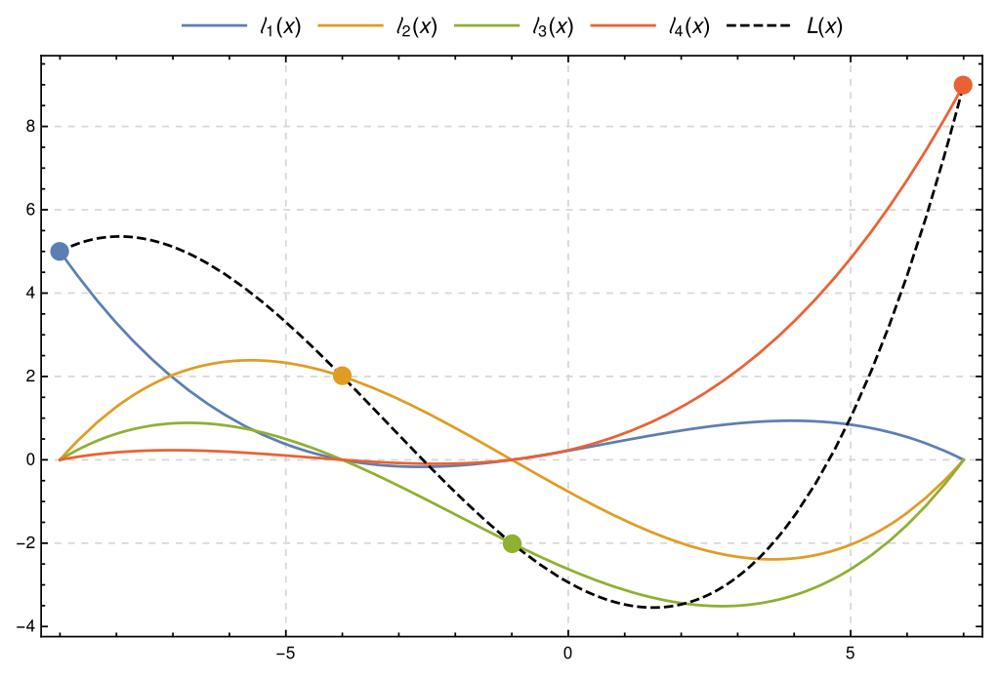
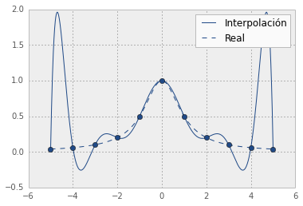

Algoritmos y complejidad 
===

### Ayudantía 3
---
# Temario
### Interpolación
- Matriz de Vandermonde.
- Método de Lagrange.
- Diferencias divididas de Newton. :alien:
- Errores de interpolación.
---
# Interpolación
- Sea  $X = \{(x_1,y_1), (x_2,y_2), \dots, (x_n, y_n)\}$ un conjunto de puntos.

- La **función** $y = P(x)$ interpola los puntos $X$ si $P(x_i) = y_i$ para cada $i \in [1,n]$.


:warning: Como $P(x)$ debe ser una función, los $x_i$ deben ser distintos.

---
### Teorema principal de interpolación polinomial
- Sea $X$ un conjunto de puntos con distintas $x$. Entonces **existe uno y solo un polinomio** $P_{n-1}$ de grado a lo más $n-1$ que satisface $P_{n-1}(x_i) = y_i$ para cada punto.
- Permite resolver un ejercicio con distintos métodos. Siempre encontraremos el mismo polinomio interpolador para un mismo conjunto de puntos. :bulb:

---
# Matriz de Vandermonde
- La idea es plantear un **sistema de ecuaciones**, analizar si tiene sentido y resolverlo en caso de ser posible. 
- Se busca el siguiente polinomio: 
$$P_{n-1}(x) = a_0 + a_1x + a_2x^2 + \dots + c_{n-1}x^{n-1} = \sum_{i = 0}^{n-1} a_ix^i$$

---

- Suponga tenemos el siguiente conjunto de puntos  $\{(x_0,y_0), (x_1, y_1), (x_2, y_2)\}$.
- Podemos plantear lo siguiente:
$$a_0 + a_1 x_1 + a_2x_1^2 = y_1$$
$$a_0 + a_1 x_2 + a_2x_2^2 = y_2$$
$$a_0 + a_1 x_3 + a_2x_3^2 = y_3$$
- Lo único que no conocemos de estas ecuaciones son los coeficientes $a_0, a_1$ y $a_2$.

---

- Esto lo podemos plantear matricialmente como:
$$\begin{pmatrix}
  1 & x_1 & x_1^2 \\
  1 & x_2 & x_2^2 \\
  1 & x_3 & x_3^2
\end{pmatrix} \begin{pmatrix}
  a_0 \\
  a_1 \\
  a_2
\end{pmatrix} = \begin{pmatrix}
  y_1 \\
  y_2 \\
  y_3
\end{pmatrix} $$

- Esto tendrá solución cuando el determinante de la matriz de los $x_i$ sea distinto de 0. Por suerte este determinante es conocido y viene dado por:

$$ \prod_{1 \leq i < j \leq n} (x_j - x_i)$$

- En este caso sería $(x_2 - x_1)(x_3 - x_1)(x_3 - x_2)$.

---
# Interpolación de Lagrange
### Notación
- Dado un conjunto de puntos $X$, definiremos el siguiente polinomio:
  $$L_k(x) = \frac{(x - x_1)\cdots (x - x_{k-1}) \cdot (x - x_{k+1}) \cdots (x-x_n)}{(x_k - x_1)\cdots (x_k - x_{k-1}) \cdot (x_k - x_{k+1}) \cdots (x_k-x_n)} $$
:bulb: Notar que $L_k(x_k) = 1$, y $L_k(x_j) = 0$ para $k \neq j$. 

---

### Polinomio interpolador, pro y contras
- El **polinomio interpolador de Lagrange** viene dado por:
$$ P_{n-1}(x) = \sum_{i=1}^n y_i\cdot L_i(x)$$

:thumbsup: Sencillo de calcular, intuitivo.
:thumbsdown: Añadir un punto nuevo implica calcular todo desde cero.

:thumbsdown: Calcular $P_{n-1}(x)$ tiene complejidad temporal $O(n^2)$ 

---
# Diferencias divididas de Newton
### Notación
- Sea  $X = \{(x_1,f(x_1)), (x_2,f(x_2)), \dots, (x_n, (f_n))\}$ un conjunto de puntos para una función $f$.
- Denotaremos por $f[x_1 x_2 \dots x_n]$ al coeficiente del término $x^{n-1}$ del único polinomio interpolador de los puntos en $X$.

---

### Cómo calcular las diferencias divididas
- Es un proceso  iterativo:
$$f[x_k] = f(x_k)$$
$$f[x_k \space x_{k+1}] = \frac{f[x_{k+1}] - f[x_k]}{x_{k+1} - x_k}$$
$$f[x_k \space x_{k+1} \space x_{k+2}] = \frac{f[x_{k+1} \space x_{k+2}] - f[x_{k} \space x_{k+1}]}{x_{k+2} - x_k}$$
$$f[x_k \space x_{k+1} \space x_{k+2} \space x_{k+3}] = \frac{f[x_{k+1} \space x_{k+2} \space x_{k+3}] - f[x_{k} \space x_{k+1} \space x_{k+2}]}{x_{k+3} - x_k}$$
Así sucesivamente.

---

### Polinomio interpolador
- $P_{n-1}(x) = f[x_1] +$ 
$\space \space \space \space \space \space \space \space \space  \space \space \space \space  \space \space \space \space  \space  \space  f[x_1x_2](x-x_1) +$ 
$\space \space \space \space \space \space \space \space \space  \space \space \space \space  \space \space \space \space  \space  \space f[x_1x_2x_3] (x-x_1)(x-x_2) +$
$\space \space \space \space \space \space \space \space \space  \space \space \space \space  \space \space \space \space  \space  \space \vdots$ 
$\space \space \space \space \space \space \space \space \space  \space \space \space \space  \space \space \space \space  \space  \space  f[x_1x_2\dots x_n] (x-x_1)\dots (x-x_{n-1})$

:thumbsup: Permite agregar más puntos de interpolación aprovechando el trabajo previo.

---
# Error de interpolación
- Sea $P_{n-1}(x)$ el polinomio que interpola los puntos
$$X = \{(x_1,f(x_1)), (x_2,f(x_2)), \dots, (x_n, (f_n))\}$$ 
- El error de interpolación es:
$$f(x) - P(x) = \frac{(x-x_1)(x-x_2)\cdots(x-x_n)}{n!}f^{(n)}(c)$$

:warning: Esto es independiente del método de interpolación.


---
- c es un valor entre $min(X)$ y $max(X)$.
- La idea es tomar un $c$ que maximice el error.
- Así obtendremos una cota superior para el error.

---
### Fenomeno de Runge
- Al realizar una interpolación de grado alto sobre puntos equiespaciados se producen oscilaciones en los extremos del intervalo.

  
- Error de interpolación en los extremos es alto.

---

# Interpolación de Chebyshev
- Suponga estamos interesados en interpolar una función en el intervalo $[-1,1]$.
- La idea es elegir cuidadosamente $n$ puntos de forma que estos **minimicen** el error de interpolación.
- Buscaremos **minimizar el valor máximo** de:
$$(x-x_1)(x-x_2)\cdots (x-x_n)$$

:bulb: Así, estamos minimizando el **peor caso** (min max) del error en la interpolación.

---

### Teorema de Chebyshev
- La selección de valores $-1 \leq x_i,\dots, x_n \leq 1$ que minimiza $max |(x-x_1)\cdots (x-x_n)|$ es:
$$x_i = cos\frac{(2i-1)\pi}{2n}, \text{para } i = 1, \dots, n$$
- Este min-max está **acotado superiormente**:  
$$ |(x - x_1) \dots (x - x_n)| \leq \frac{1}{2^{n-1}}$$


--- 
- Al interpolar estos puntos, el error se distribuirá uniformemente. Adios Runge.

---

### Cambio de intervalo
- Para un intervalo general $[a,b]$ los puntos de Chevyshev vienen dados por:
$$x_i = \frac{b+a}{2} + \frac{b-a}{2}\cdot cos\frac{(2i-1)\pi}{2n}, \text{para } i = 1,\dots, n$$
- En este caso la cota superior será:
$$ |(x - x_1) \dots (x - x_n)| \leq\frac{(\frac{b-a}{2})^n}{2^{n-1}}$$

---
# Ejercicios
1. Interpole el siguiente conjunto de puntos mediante el Lagrange: $X = \{(1,1), (2, 5), (3, 4)\}$
2. Interpole el mismo conjunto de puntos mediante **diferencias divididas**.
   
---
3. Agregue los puntos $(4,6) \text{ y } (5,2)$ al conjunto $X$  e interpole nuevamente.

**Hint:** La solución es:
```python
def p(x):
    return (-5/2)* (x**2) + (23/2)*x - 8 + (4/3)*(x**3 - 6*(x**2) + 11*x - 6) 
          - (17/24)*(x**4 - 10 * (x**3) + 35*(x**2) - 50*x + 24)
```