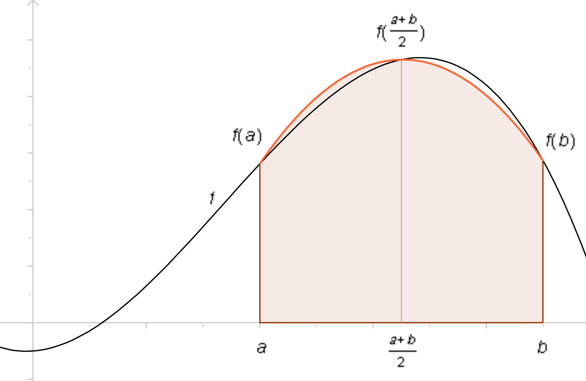

Algoritmos y complejidad 
===

### Ayudantía 4
---
# Temario
### Cuadratura
- Aproximación con rectángulos
- Regla del Trapecio (primer grado)
- Regla de Simpson (segundo grado)

---
# Cuadratura
- Dada una función de interés $f(x)$ y un intervalo $[a,b]$, buscamos aproximar $\displaystyle \int_a^b f(x) dx$.

---
# Aproximación con rectángulos
- Aproximaremos la integral mediante un **número finito de rectángulos**.
- Considere un intervalo $[x_0, x_1, x_2 , \dots, x_n]$ donde $x_0 = a$, $x_n = b$.
- Podemos aproximar la integral mediante:
$$
\int_a^b f(x)dx \approx \sum_{i = 0}^n f(x_i) \cdot (x_{i+1} - x_i)
$$

---
- Es claro que si $x_{i+1} - x_i = \frac{b-a}{n} = h$ tenemos:
$$
\int_a^b f(x)dx \approx h\sum_{i = 0}^n f(x_i) 
$$
- Notar lo simple que sería programar este método.

---
- Si evaluamos en el punto medio del intervalo $x_{i+1} - x_i$ obtendremos generalmente mejores aproximaciones.

$$
\int_a^b f(x)dx \approx h\sum_{i = 0}^n f (\frac{x_i + x_{i+1}}{2}) 
$$

---
## Análisis error

### Caso general
- Al expandir $\displaystyle F(x) = \int_{x_i}^x f(t)dt$ mediante Taylor alrededor de $x_i$ se obtiene:
$$
\int_{x_i}^{x_{i+1}} f(x) dx = hf(x_i) + h^2\frac{f^\prime(c)}{2}
$$
- donde $h = x_{i+1} - x_i$ y $c \in [x_i, x_{i+1}]$.
- El error es $\displaystyle h^2 \frac{f^\prime(c)}{2}$, es decir $O(h^2)$ **para cada intervalo**.

---
- Considerando $h = \frac{b-a}{n}$, el error para $n$ intervalos de largo $h$ es $nO(h^2)$. 
- Aplicando **poderosas matemáticas** obtenemos:
$$
nO(h^2) = nO(\frac{(b-a)^2}{n^2}) = O(\frac{n(b-a)^2}{n^2}) \\ \qquad \qquad \quad  \space \space \space = O(\frac{(b-a)^2}{n}) = O((b-a)h) = O(h)
$$
> A medida que $n \rightarrow \infty$ disminuiremos el error pues $h$ se hace más pequeño.

---
### Variación Punto medio
- Evaluando en el punto medio de cada intervalo tenemos:
$$\int_{x_i}^{x_{i+1}} f(x) dx = hf(x_i) + \frac{1}{24} f^{\prime \prime}(a)h^3 + O(h^4)
$$
- El error es $O(h^3)$ **para cada intervalo**.
- Esto es mejor que el error $O(h^2)$ para el primer caso analizado.

---
# Regla del Trapecio
- Aproximaremos la integral $\displaystyle \int_a^b f(x) dx$ mediante un número finito de trapecios.
- Recordar que el área de un trapecio es $\frac{b_1 + b_2}{2} \cdot h$
  

> Podemos ver el trapecio como si estuviera acostado, de forma que $b_1$ y $b_2$ los obtendremos como imágenes de $f$ y $h$ como $x_{i+1} - x_i$.

---
### Deducción
Considere un intervalo $[x_0, x_1, x_2 , \dots, x_n]$, $x_0 = a$, $x_n = b$ y  $x_{i+1} - x_i = \frac{b-a}{n} = h$, donde $n$ es el número de trapecios.

:arrow_right: Para $n = 2$ tenemos:

$$ \int_a^b f(x)dx \approx \frac{h}{2}(f(a)
 + f(x_1)) + \frac{h}{2}(f(x_1) + f(b))
$$

:arrow_right: Para $n = 3$ tenemos:

$$ \int_a^b f(x)dx \approx \frac{h}{2}(f(a)
 + f(x_1)) + \frac{h}{2}(f(x_1) + f(x_2)) + \frac{h}{2}(f(x_2) + f(b))
$$

---
:arrow_right: De forma general: 
$$
\int_a^b f(x) dx \approx \frac{h}{2}(f(a) + 2f(x_1) + 2f(x_2)\dots + 2f(x_{n-1}) + f(b))
$$

:arrow_right: Esto se puede reescribir como:
$$
\int_a^b f(x) dx \approx h(\frac{f(a) + f(b)}{2} + \sum_{i = 1}^{n - 1} f(x_i))
$$

---
### Deducción mediante interpolación
- Trabajaremos en un intervalo $[x_0, x_1]$.
- Para aproximar $\displaystyle\int_{x_0}^{x_1} f(x) dx$, primero interpolaremos $f(x)$ mediante un polinomio $P(x)$ de grado 1, y luego integraremos $P(x)$. :thinking:
- ¿Cuál polinomio utilizamos?
$$
P(x) = y_0\frac{x - x_1}{x_0 - x_1} + y_1\frac{x - x_0}{x_1 - x_0}
$$
> Este es el **polinomio interpolador de Lagrange**.

---
- Integrando P$(x)$ obtenemos:
    $$
    \int_{x_0}^{x_1} P(x) dx= y_0 \int_{x_0}^{x_1}\frac{x - x_1}{x_0 - x_1} dx+ y_1 \int_{x_0}^{x_1} \frac{x - x_0}{x_1 - x_0}dx
    $$
    $$
    \qquad \qquad  \quad= y_0 \frac{x_1 - x_0}{2} + y_1 \frac{x_1 - x_0}{2} = \frac{h}{2} \cdot(y_0 + y_1)
    $$

- Notar que llegamos al área del trapecio presentada anteriormete. 

---
### Análisis error
- Al aproximar la integral $\displaystyle \int_a^b f(x)dx$ usando $n$ trapecios tenemos que:

$$E = -\frac{f^{\prime \prime}(c) \cdot (b-a)}{12}h^2$$
- Donde $c$ es un valor en $[a,b]$.
- Notar que es mejor que el método de los rectángulos pues el error es $O(h^2) = O((\frac{b-a}{n})^2) = O(\frac{1}{n^2})$ .
> Nuevamente podemos tomar el valor $c$ que maximiza $f^{\prime \prime}(c)$ y obtener una cota superior para el error.

--- 
### Regla compuesta
Para $n$ trapeceios tenemos:
$$ \int_a^b f(x)dx = \frac{h}{2} (y_0 + y_n + 2 \sum_{i = 1}^{n - 1} y_i) - \frac{(b-a)h^2}{12} f^{\prime \prime} (c)$$

Donde $h = \frac{b-a}{n}$ y $c \in [a,b]$.

---
# Regla de Simpson
- Similar a la regla del Trapecio, pero mejor aún.
- El polinomio a interpolar ahora será de **grado 2**  (parábola).

---
### Deducción mediante interpolación
- Trabajaremos en un intervalo $[x_0, x_1, x_2]$.
- Para aproximar $\displaystyle\int_{x_0}^{x_1} f(x) dx$, primero interpolaremos $f(x)$ mediante un polinomio, y luego integraremos el polinomio. :thinking:
- ¿Cuál polinomio utilizamos?
    $$
    P(x) = y_0\frac{(x - x_1)(x - x_2)}{(x_0 - x_1)(x_0 - x_2)} + y_1\frac{(x - x_0)(x - x_2)}{(x_1 - x_0)(x_1 - x_2)} + y_2\frac{(x - x_0)(x - x_1)}{(x_2 - x_0)(x_2 - x_1)}
    $$

---
Integrando cada término por separado:
$$
\int_{x_0}^{x_2} y_0\frac{(x - x_1)(x - x_2)}{(x_0 - x_1)(x_0 - x_2)} dx = y_0\frac{h}{3}
$$

$$
\int_{x_0}^{x_2} y_1\frac{(x - x_0)(x - x_2)}{(x_1 - x_0)(x_1 - x_2)} dx = y_1\frac{4h}{3}
$$

$$
\int_{x_0}^{x_2} y_2\frac{(x - x_0)(x - x_1)}{(x_2 - x_0)(x_2 - x_1)} dx = y_2\frac{h}{3}
$$
---
Así obtenemos:
$$\int_{x_0}^{x_2} P(x) dx = y_0\frac{h}{3} + y_1\frac{4h}{3} + y_2\frac{h}{3}$$

> Notar que las integrales son simples. Los términos $y_i$ y los denominadores son constantes. 
---
### Análisis error

- Al interpolar sabemos que $f(x) = P(x) + E(x)$.
- $\displaystyle \int_{x_0}^{x_2} E(x) dx = - \frac{h^5}{90} f^{(4)}(c)$.
- $\displaystyle \int_{x_0}^{x_2} f(x) dx = \frac{h}{3}(y_0 + 4y_1 + y_2) - \frac{h^5}{90} f^{(4)}(c)$.
- Donde $c \in [x_0, x_2]$
---
### Regla compuesta

$$\int_a^b f(x) dx = \frac{h}{3}(y_0 + y_{2m} + 4\sum_{i=1}^m y_{2i - 1} + 2\sum_{i=1}^{m - 1} y_{2i}) - \frac{(b-a)h^4}{180} f^{(4)}(c)$$

Donde $m = \frac{n}{2} = \frac{b-a}{2h}$ y $c \in [a,b]$.

---

# Recomendaciones
1. https://es.khanacademy.org/math/ap-calculus-ab/ab-integration-new/ab-6-2/a/understanding-the-trapezoid-rule