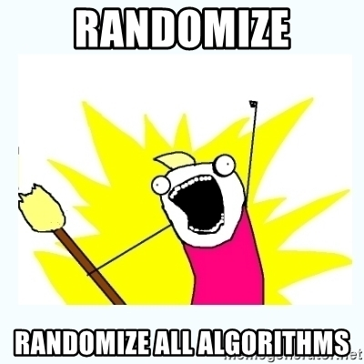
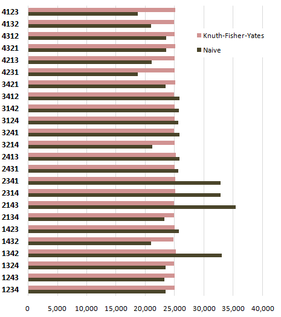

Algoritmos y complejidad 
===

### Ayudantía 9
---

# Temario
- ¿Por qué algoritmos aleatorizados?.
- Clasificaciones
- Ejemplos de interés:
    - Muestreo de Monte Carlo.
    - Estimación de $\pi$ por Monte Carlo.
- Ejercicios
    - Guess_pass.
    - Shuffle.

---
# ¿Por qué algoritmos aleatorizados?
- Existen situaciones en que los algoritmos convencionales presentan problemas; alta complejidad temporal o worst cases de desempeño muy malos.
- Algoritmos deterministas no siempre son buenos aliados.
- Algoritmos aleatorizados son simples y rápidos, pero aparecen **variables aleatorias** en el tiempo de ejecución y/o en el output.


---
# Clasificaciones
## A las vegas Algorithm 
- Probablemente rápidos.
- Siempre encuentra la respuesta correcta, pero puede demorar una cantidad de tiempo excesiva. 
-  Sea $RT(u)$ el tiempo de ejecución del algoritmo cuando el input es $u$. El **tiempo de ejecución esperado del algoritmo** para entradas de tamaño $n$ viene dado por:
$$
T(n) =  max_{|u| = n} \space  E[ RT(u)]
$$

> El máximo valor esperado del tiempo de ejecución del algoritmo para inputs de tamano $n$. :alien:
---

## Montecarlo Algorithm
- Probablemente correctos.
- Entrega una respuesta aproximada en una cantidad de tiempo fijo determinada a través de un parametro. 

Patrón por defecto:
1. Define a domain of possible inputs.
2. Generate inputs randomly from a probability distribution over the domain.
3. Perform a deterministic computation on the inputs.
4. Aggregate the results.
> https://en.wikipedia.org/wiki/Monte_Carlo_method

---
### Errores
- Error unilateral: Siempre se equivocan en el mismo sentido, pueden ser con preferencia falso o preferencia verdadero. Nunca se equivocan en su preferencia, por lo que la repetición del algoritmo reduce la probabilidad de error.
- Error bilateral: Se pueden equivocar en ambos sentidos.

---

# Muestreo de Monte Carlo
Como aproximaría la siguiente sumatoria?:
$$
 \sum_{n = 1}^N f(n) 
$$

---

- La idea es ver la sumatoria como si fuera una esperanza:

$$
 \sum_{n = 1}^N f(n) = \sum_{n = 1}^N f(n) \cdot p(n) = E_p[f(n)]
$$
- Ahora la podemos aproximar **tomando una muestra** $x_1, x_2, \dots, x_n$ desde $p$ y luego calcular el promedio empírico:
$$
\hat{s} = \frac{1}{n} \sum_{i = 0}^n f(x_i)
$$
> https://www.deeplearningbook.org/contents/monte_carlo.html :heart:
---

Recordar que la ley de los grandes números respalda esta aproximación bajo los supuestos de una muestra $x^{(i)}$ independiente e identicamente distribuida y un tamaño de muestra $n$ muy grande.


---

Cómo usaria el muestreo de Montecarlo para estimar una integral?, cuál funcion de probabilidad $p(x)$ utilizaría para estimar integrales como la siguiente :question:

$$\displaystyle \int_{-a}^a \frac{1}{x^2 + 1}$$


---
# Estimación de $\pi$

- La idea es generar $n$ puntos aleatorios en el primer cuadrante, es decir $x,y \in [0,1]$.
- Contar aquellos que están dentro (inside) de la circunferencia de radio 1 y la cantidad total de puntos.
- Estimar $\pi$ asumiendo que:
$$
\frac{\pi r^2}{4r^2} \approx \frac{I}{T} 
$$


> https://brilliant.org/wiki/randomized-algorithms-overview/

---
# Ejercicios

---

## Ejercicio 1 

Suponga una versión del Aula donde las contraseñas están solo formadas por dígitos, con un mínimo de 5 y máximo de 10. 
- Diseñe un algoritmo aleatorio **que encuentre la contraseña** para un usuario dado. 
- Analice brevemente el algoritmo, indique el promedio de comparaciones a realizar para encontrar una contraseña de $n$ digitos. 
- Indique el tiempo de ejecución esperado para el algoritmo diseñado.


---
#### Diseño

```python
def guess_pass(n, password):
    guess = generate_guess(n)
    while(check_pass(guess, password) == False):
        guess = generate_guess(n)
    return guess
    
```

> Monte carlo o Las vegas?

---
#### Análisis
1. El tiempo de ejecución para una entrada $u$ es $RT(u)$.
2. $RT(u)$ es una variable aleatoria. Sea $I$ el conjunto de posibles valores para $u$:
$$
RT(u): I\rightarrow \R^+
$$
3. La distribución asociada a $RT(u)$ es la geométrica.

---
4. La probabilidad de éxito en función del tamaño del input viene dada por:
$$
p(n) = \frac{1}{10^n}
$$
5. Sabemos que $E[RT(u_n)] = \frac{1}{p(n)}$. En promedio, encontrar la contraseña tomará $10^n$ comparaciones (intentos).
6. El tiempo de ejecución esperado es $T(n) = 10^n$.

---
## Ejercicio 2
Dado un arreglo $A$ de tamaño $n$, diseñe un algoritmo para "barajar" (shuffle) $A$ de forma que el output sea una variable aleatoria que siga una distribución uniforme.

---

Diseño Naive

```python
def naive_shuffle(A):

    # for each element of A
    for i in range(len(A)):

        # select a random index of A
        rand_index = random.randint(0, len(A) - 1)

        # swap element number i with element number random_index
        temp = A[i]
        A[i] = A[rand_index]
        A[rand_index] = temp
```

---

Diseño Fisher

```python
def fisher_shuffle(A):

    # for each element of A
    for i in range(len(A)): 

        # select a random index of A[:i + 1]
        j = random.randint(0, i) 

        # swap element number i with element number j
        temp = A[i]
        A[i] = A[j]
        A[j] = temp
```

---
Cuántas permutaciones (swaps) puede realizar cada algoritmo?:thinking:


---
##### Naive shuffle
En cada iteracion $i = 1 \dots n$ tenemos $n$ alternativas para hacer un swap entre el elemento $i$ y otro aleatorio. En total tenemos $n^n$ posibles permutaciones (swaps).

##### Fisher shuffle
En cada iteracion $i = 1 \dots n$ tenemos $i$ alternativas para hacer un swap entre el elemento $i$ y otro en la posicion $j \leq i$. En total tenemos $n!$ posibles permutaciones (swaps).

---
- Cada permutación (swap) me lleva de una configuración a otra. 
- Para un arreglo $A$ de tamaño $n$ existen $n!$ posibles configuraciones.
- Naive elige entre $n^n$ configuraciones (pues cada swap me lleva a una configuración), esto es problemático pues solo existen $n!$. Hay algunas que se repiten.

>

---


> Array de tamaño 4 barajado 600.000 veces con ambos algoritmos.
 https://blog.codinghorror.com/the-danger-of-naivete/

---
##### Conclusiones

- Naive shuffle baraja de más (overshuffle). Esto implica permutaciones sobre representadas; son más probables que otra.
- En cada iteración puede estar haciendo un swap con un mismo elemento $a$. Peor aún, puede hacer un shuffle más de una vez con dos elementos $a$ y $b$.

---
- Hay que tener cuidado a la hora de diseñar algoritmos aleatorizados, la idea es obtener algoritmos **no sesgados**.
- Recordar que el output será una variable aleatoria $OP(n)$. Conocer como se distribuye $OP$ es de vital importancia para entender el comportamiento del algoritmo.